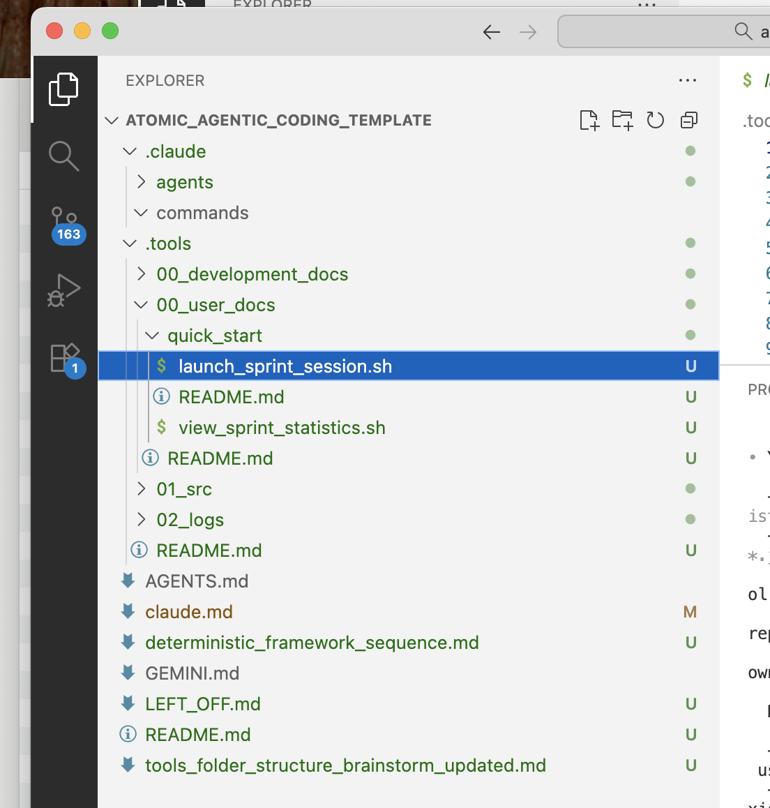

# Next Steps for Claude

## Instructions
*Let's process this doc together in batches of 5 items*
**For each batch of 5 items**, please do the following:
1. Identify the batch of 5
2. Concisely organize and restate my ideas back to me
3. Ask clarifying questions as you appraise the ideas
4. Wait for my response
5. Give me your reflections and recommendations for changes
6. Wait for me to approve
7. Create a to-do list and then implement

## General Feedback 
*Content for batches of 5.*

- To answer your immediate question: yes - they live in separate repos.  And cleaning/refactoring those is on my short-list and is included in the immediate workflow document.

- Create a claude.md in which you capture core insights about this repo, it’s purpose, and immediate next steps: 
    “Your Refined Strategy

    Guiding Star: Build immediately useful tools first, worry about integration later

    Key Principles:
    1. Value-first: Each tool must provide standalone value in real projects NOW
    2. Separate development repos: Build/iterate each tool in its own repo (keeps development messy work contained)
    3. This repo = integration hub: .agentic_repo_tool is the clean assembly point, not the workshop
    4. Mostly-deterministic tools: Focus on reliable, repeatable utilities (not complex agentic orchestration yet)
    5. Natural cohesion: Tools will "work well together" because they share conventions, not because of complex integration code

    What This Changes

    Old mental model: Build grand architecture → fit tools into it
    New mental model: Build useful tools → discover their natural organization

    This means:
    - Each tool repo has its own README, tests, development history
    - When a tool is "done enough", copy it into .agentic_repo_tools/01/tools_src/
    - This repo documents conventions (how tools should behave, where they write output)
    - Tools evolve independently; integration repo pulls in stable versions”
- Next, I would like for us to work together to review and update the planning_docs which you generated - and review the existing docs for deprecation or for moving useful info into the outlines of our new organized docs
- you said "Question 3 still unresolved: "Why custom .agentic_repo_tools/ structure vs standard Python package?" This is the last conceptual question—but it's better answered after building
  the MVP and seeing if the structure actually helps or creates friction." - I would like your opinion on this and for you to educate me about how the classic structure would work and advantages / disadvantages it has compared to our current plan.

# Feedback Regarding docs in "plannind_docs" 
## MVP.md
- The MVP of this repo is completion of thorough/cohesive cleaning of current docs including:
  1.  clean planning docs
      * combination/process of the ones in our general repo + 
      * delivery of first cleaned/effective tool
  2. Incorporation/clear-integration of incremental self-contained tools:
      * logging tool (at least extracting the core functional code from the mess it is currently in this repo with key components as shown in this image:  - note: it's currently a very messy repo)
      * auto_move
      * auto_resize
      * auto_doc

## Immediate Workflow.md 
- Should capture that our first task is cleaning current repo, we already added to git, so that is good, 
- Need to clearly capture progression of tools to add (the logging, then the auto_move, then the auto_resize 

